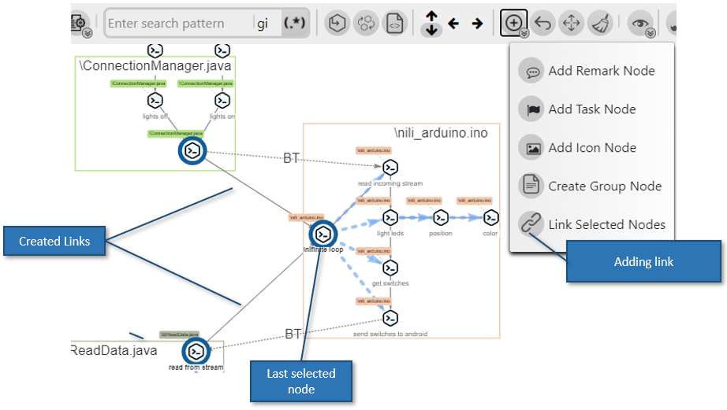
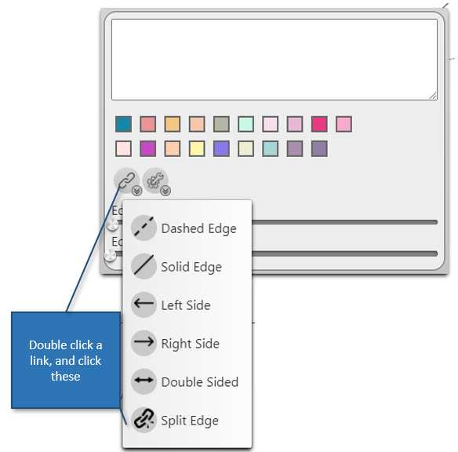

# Adding nodes

## Creating a node

- Create nodes by selecting text in the Code View and clicking 'Create Match'

## Updating a node

- Set nodes to different code line by using 'Replace Node'

1. Select the node to be replaced
2. Click 'Replace Node'
3. Select the new Code Line

## Add File nodes ('open file')

- Add a file node with the 'Add file' button

  

---

# Links

## Add a link

Select multiple nodes and click 'Add Item' -> 'Add Link'
A link will be created from all selected nodes to last selected node

---

## Split a link

Double click a link to see the styling menu, and select 'Split Link' from 'Edge Options'

---

# Adding Logical Groups

You can add a "Logical group" for marking a section of diagram with a single goal

---
