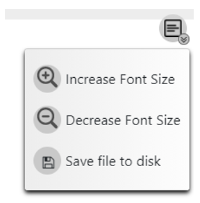

# Save, Load, Reload From Code

## Refreshing diagram from updated code

You can update the diagram with recent changes in code. This is practical for using old diagrams and for continuous work when you`re toggling between code writing and charting it.

---

## Saving and loading diagrams

- When saving, put meaningful description and story name
- You can download to Knowledge Center
- You can download diagram to file to attach to tasks in you project managemtn system
- You can overlay loaded diagrams on top of current diagrams

---

## Code Editor

- You can increase and decrease font size
- You can edit the code and save to disk

