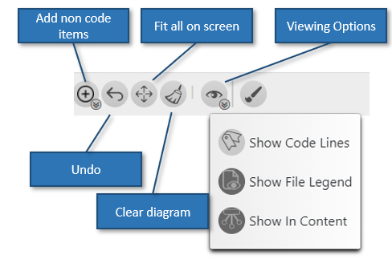
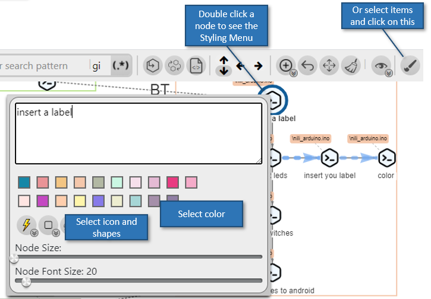

# Diagram Options and actions

- Fit all nodes to sceen
- Undo
- Adding remark nodes and other types of nodes
- Different viewing options

---

# Styling Nodes

- Double click a node or edge to see the Styling Menu
- You can select multiple iems and click the 'Styling Menu' button on the top bar
- Set a label for your items by typing in the text area

---
