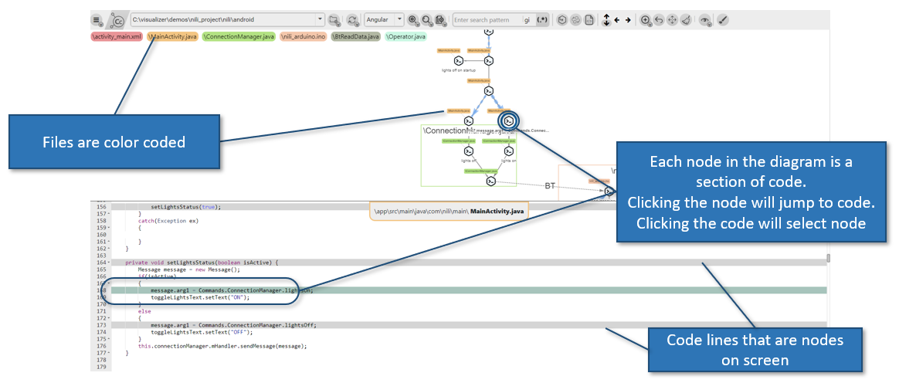
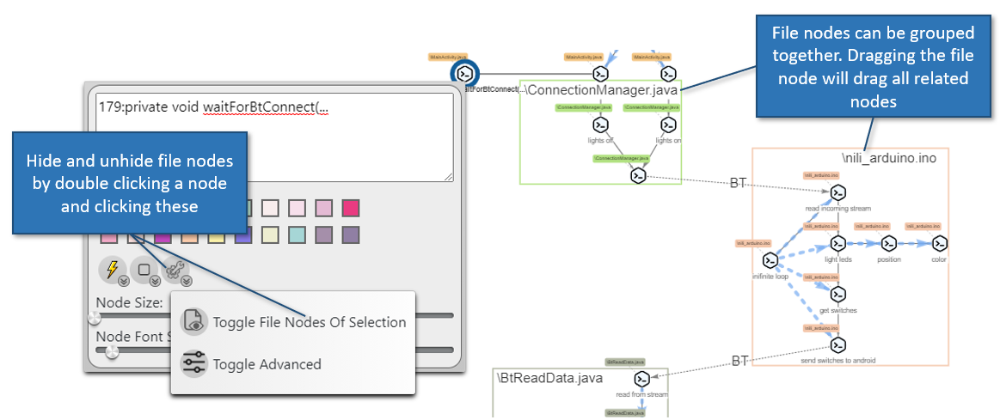
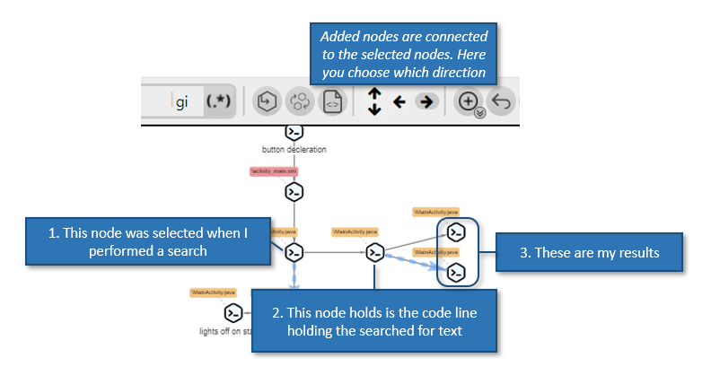
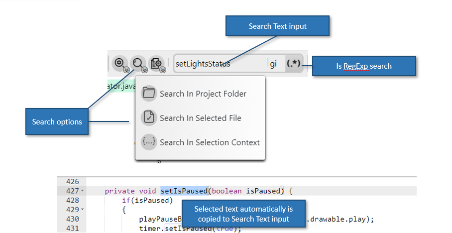
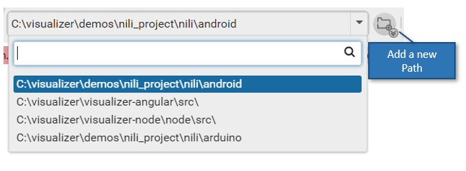
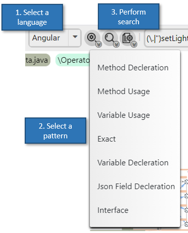
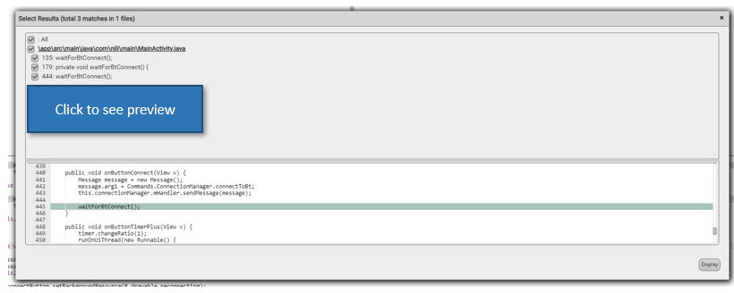
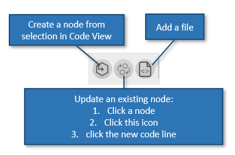
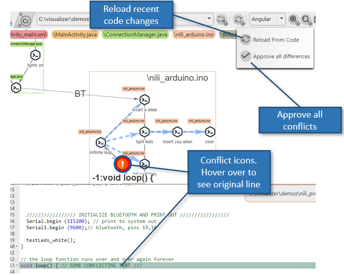
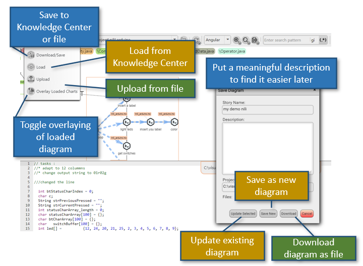

# How to use

### What do I see on screen

# Basics

- Two views: The Diagram and the Code View
- Each node represents a section of code
- Files are color coded above the node and in the legend

# File Groups

- Files can be represented as groups. Displayed file nodes will show a rectangle around all corresponding nodes
- Dragging the file node will select al corresponding nodes
- deleting a file node will delete all it`s children
- Hide and unhide file nodes double clicking a related node and selecting 'Options' -> 'Hide File Group'

### How The chart unfolds

### Searching

# Basics

- Select text to search for in code view, or enter manually to input.
- Click on what type of search to perform
- Optionally set a regexp seacrh
- Optionally set a file mask for file types to be searched

- You can change Project Folder at any time
  

# Smart Search

- Select text to search
- Select a search pattern
- You can select different language patterns
- Perform the search like in the previous

* you can add or edit or remove search patterns in config/languages.json
  

### Search Results

You can preview search results and select which ones to add

### Selecting multiple items

- Click the 'ctrl' key and click on items
- Click the right mouse button and drag. Items in that area are selected

### Adding nodes

# Creating a node

- Create nodes by selecting text in the Code View and clicking 'Create Match'

# Updating a node

- Set nodes to different code line by using 'Replace Node'

1. Select the node to be replaced
2. Click 'Replace Node'
3. Select the new Code Line

# Add File nodes ('open file')

- Add a file node with the 'Add file' button

  

### Links

# Add a link

Select multiple nodes and click 'Add Item' -> 'Add Link'
A link will be created from all selected nodes to last selected node

# Split a link

Double click a link to see the styling menu, and select 'Split Link' from 'Edge Options'

### Diagram Options and actions

- Fit all nodes to sceen
- Undo
- Adding remark nodes and other types of nodes
- Different viewing options

### Adding Logical Groups

You can add a "Logical group" for marking a section of diagram with a single goal

### Styling Nodes

- Double click a node or edge to see the Styling Menu
- You can select multiple iems and click the 'Styling Menu' button on the top bar
- Set a label for your items by typing in the text area

### Refreshing diagram from updated code

You can update the diagram with recent changes in code. This is practical for using old diagrams and for continuous work when you`re toggling between code writing and charting it.

### Saving and loading diagrams

- When saving, put meaningful description and story name
- You can download to Knowledge Center
- You can download diagram to file to attach to tasks in you project managemtn system
- You can overlay loaded diagrams on top of current diagrams

### Code Editor

- You can increase and decrease font size
- You can edit the code and save to disk

